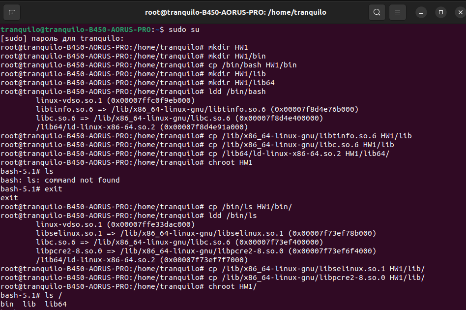
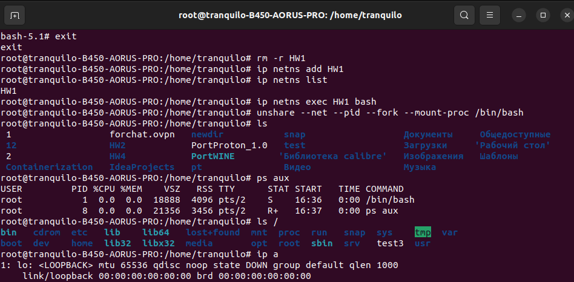

### Создаём директорию и копируем туда bash
```sh
sudo su
mkdir HW1
mkdir HW1/bin
cp /bin/bash HW1/bin
```
### Создаём директории для библиотек и копируем недостающие для bash 
```sh
mkdir HW1/lib
mkdir HW1/lib64
ldd /bin/bash
cp /lib/x86_64-linux-gnu/libtinfo.so.6 HW1/lib
cp /lib/x86_64-linux-gnu/libc.so.6 HW1/lib
cp /lib64/ld-linux-x86-64.so.2 HW1/lib64/
```
### Меняем корневой каталог для текущего процессы на HW1 и пробуем вызвать ls
```sh
chroot HW1
ls
```
### Копируем ls и недостающие библиотеки. Сглва пыаемся вызвать ls из изолированной среды
```sh
cp /bin/ls HW1/bin/
ldd /bin/ls
cp /lib/x86_64-linux-gnu/libselinux.so.1 HW1/lib/
cp /lib/x86_64-linux-gnu/libpcre2-8.so.0 HW1/lib/
chroot HW1/
ls /
```


### Создаём новое пространство имён для изоляции сетевых ресурсов с названием HW1. Выводим на экран список доступных пространств имён
```sh
exit
rm -r HW1
ip netns add HW1
ip netns list
```
### Запускаем оболочку bas внутри пространства имён HW1
```sh
ip netns exec HW1 bash
```
### Создаем новый процесс с изолированными сетевыми и процессными пространствами, а также монтирует файловую систему /proc для наблюдения за процессами. Запускаем оболочку Bash в этом новом изолированном окружении.
```sh
unshare --net --pid --fork --mount-proc /bin/bash
```
### Выводим список файлов и каталогов в текущем рабочем каталоге.
```sh
ls
```
### Выводим список текущих процессов внутри изолированной среды.
```sh
ps aux
```
### Выводим список файлов и каталогов в корневом каталоге системы внутри изолированной среды.
```sh
ls /
```
### Выводим информацию о сетевых интерфейсах внутри изолированной среды
```sh
ip a
```



