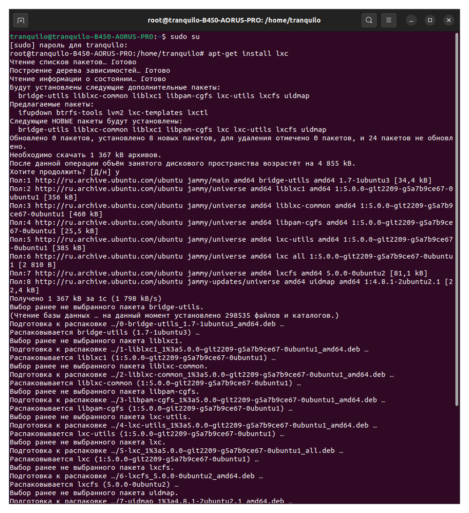
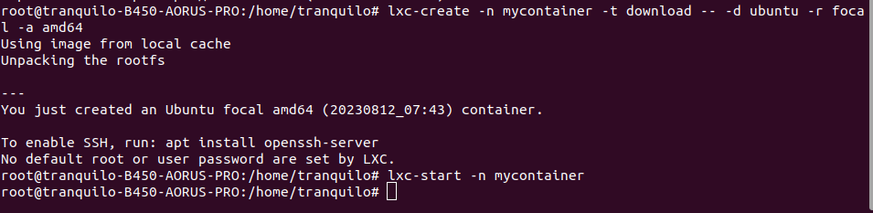
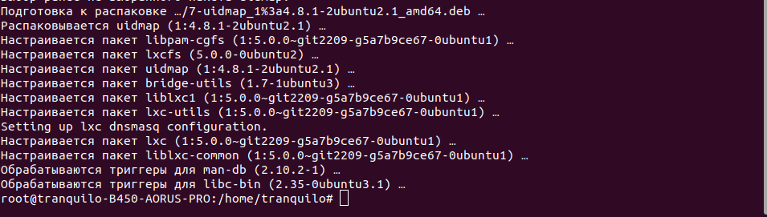
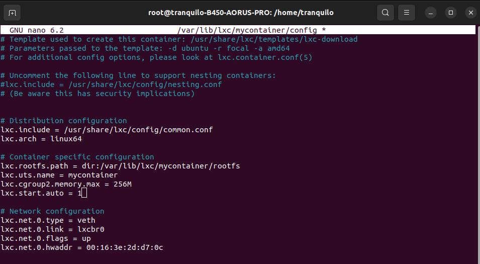
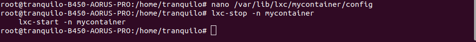
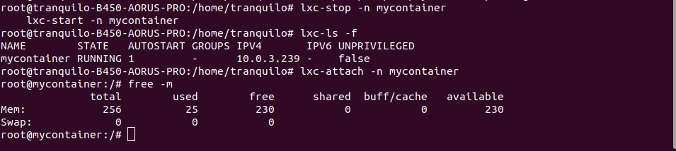
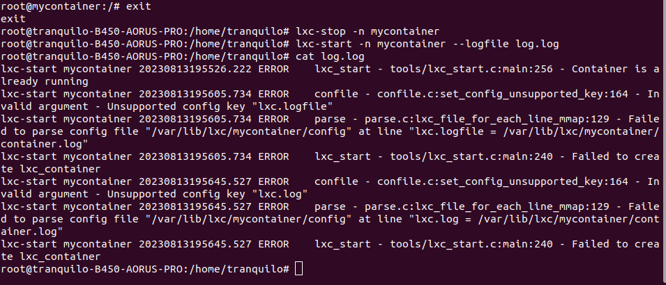

### Установка LXC:
```sh
apt-get install lxc
```


### Создание и настройка контейнера:
```sh
lxc-create -n mycontainer -t download -- -d ubuntu -r focal -a amd64
lxc-start -n mycontainer
```

### Автозапуск контейнера и ограничение памяти:
```sh
nano /var/lib/lxc/mycontainer/config
lxc.cgroup2.memory.max = 256M
lxc.start.auto = 1
```


### Перезагрузка и анализ логов: 
```
lxc-start -n mycontainer --logfile log.log
lxc-attach -n mycontainer
free -m
```


