# 1 - устанавливаем Докер
## Обновляем списки пакетов:
```sh
sudo su
apt update
```
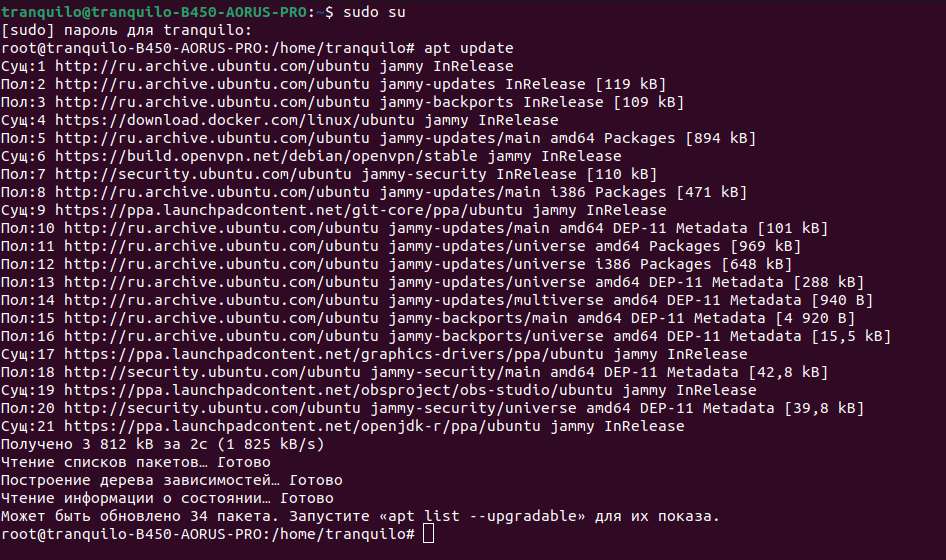
## Устанавливаем пакеты, которые позволят использовать репозиторий по HTTPS:
```sh
apt install apt-transport-https ca-certificates curl software-properties-common
```
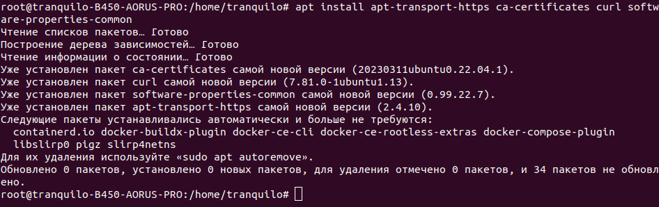
## Добавляем официальный GPG-ключ Docker:
```sh
curl -fsSL https://download.docker.com/linux/ubuntu/gpg | gpg --dearmor -o /usr/share/keyrings/docker-archive-keyring.gpg
```
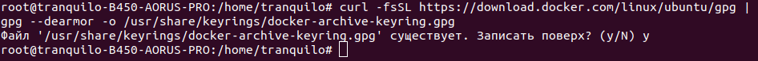
## Записываем информацию о репозиториях Docker в файл docker.list в директории /etc/apt/sources.list.d/, стобы система знала, где искать пакеты Docker при использовании менеджера пакетов apt.
```sh
echo "deb [signed-by=/usr/share/keyrings/docker-archive-keyring.gpg] https://download.docker.com/linux/ubuntu $(lsb_release -cs) stable" | tee /etc/apt/sources.list.d/docker.list > /dev/null
```
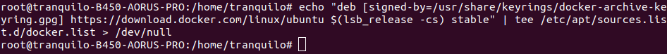
## Обновляем список пакетов, чтобы включить информацию о пакетах Docker из добавленного репозитория:
```sh
apt update
```
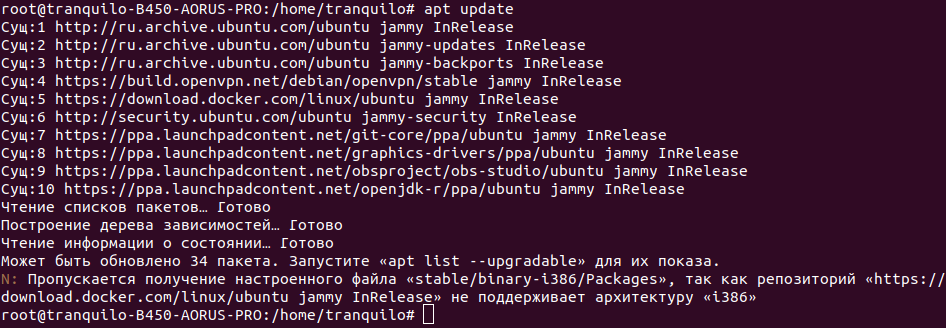
## Установливаем Docker:
```sh
apt install docker-ce
```


## Добавляем пользователя в группу docker, чтобы избежать использования для запуска Docker команд. Изменяем имя текущей группы пользователя на группу с именем "docker" на время текущего сеанса. Проверяем версию docker.
```sh
usermod -aG docker $USER
newgrp docker
docker --version
```
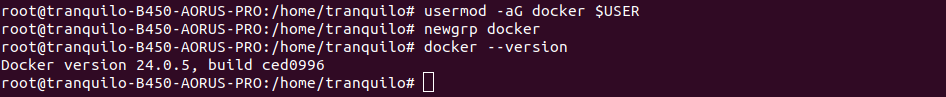
# 2 - тестируем
## Запускаем контейнер с использованием образа "cowsay":
```sh
docker run docker/whalesay cowsay Hello, Docker!
```
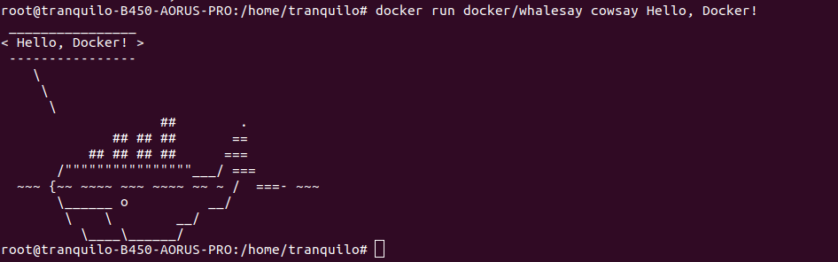
## Для начала давайте запустим контейнер из образа Ubuntu и войдем в него. Посмотрим содержимое корневой директории. Создадим новую директорию в корне. Создадим файл "passwords.txt" и добавим в него какие-либо данные.
```sh
docker run -it --hostname GB --name gb-test ubuntu:22.10 /bin/bash
ls -l /
mkdir /example
touch /example/passwords.txt
echo "123test" >> /example/passwords.txt
```
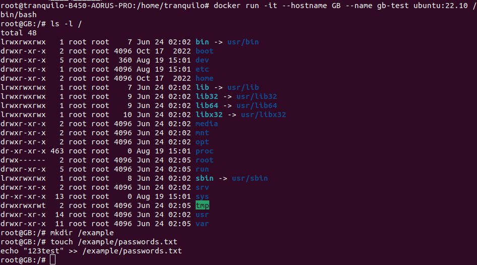

## Попробуем остановить контейнер и затем запустить его снова.
```sh
docker stop gb-test
docker start gb-test
docker exec -it gb-test bash
cat /example/passwords.txt
```
Наши данные на месте
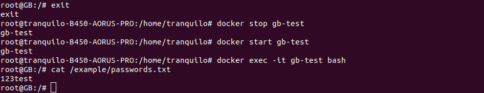
Удалим контейнер и создадим его заново, используя те же команды:
```sh
docker stop gb-test
docker rm gb-test
docker run -it -h GB --name gb-test ubuntu:22.10
cat /example/passwords.txt
```
После удаления контейнера наши данные исчезли
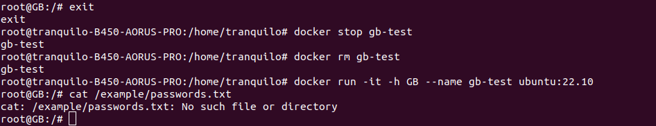
## Создадим директорию и подмонтируем ее к контейнеру. Добавим данные в подмонтированную директорию.
```sh
docker rm gb-test
mkdir /test
mkdir /test/folder
docker run -it -h GB --name gb-test -v /test/folder:/otherway ubuntu:22.10
echo "$HOSTNAME" >> /otherway/test.txt
exit
cat /test/folder/test.txt
```
В хостовой системе данные также были изменены
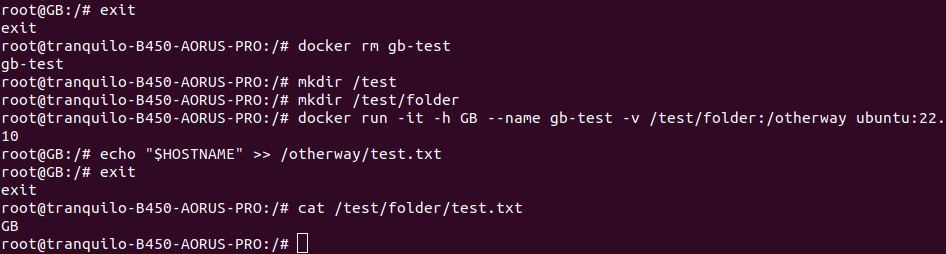
## Удалим контейнер и создадим его снова, подмонтировав директорию:
```sh
docker rm gb-test
docker run -it -h GB --name gb-test -v /test/folder:/otherway ubuntu:22.10
```
Данные по прежнему на месте
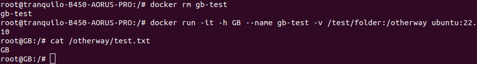
# 3 - хранение данных в контейнерах Docker
## Создаём папку, которую мы будем готовы смонтировать в контейнер.В этой папке создаём файл test.txt и наполняем его данными. Создаём вторую такую же директорию с таким же файлом но с другим наполнением.Создаём контейнер из образа ubuntu:22.10 и задайте ему имя и hostname монтируем ранее созданную папку с хоста в контейнер.
```sh
mkdir -p /root/docker-mount-example/
touch ~/docker-mount-example/test.txt
echo "This is the host test.txt file" > ~/docker-mount-example/test.txt
mkdir -p /root/docker-mount-example2/
touch ~/docker-mount-example2/test.txt
echo "This is the root test.txt file" > ~/docker-mount-example2/test.txt
docker run -it -h GB --name gb-test -v ~/docker-mount-example:/container-mount ubuntu:22.10
```
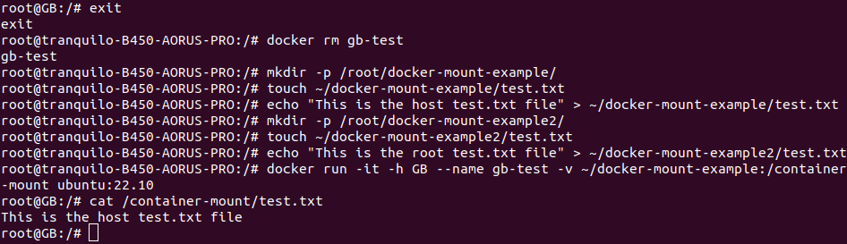
 ## Монтируем созданный ранее текстовый файл из домашней директории внутрь смонтированной папки в контейнере и перемонтируем в контейнер другой текстовый файл из другой хостовой директории. Выводим результат на экран.
```sh
exit
docker rm gb-test
docker run -it -h GB --name gb-test -v ~/docker-mount-example:/container-mount -v ~/docker-mount-example2/test.txt:/container-mount/test.txt ubuntu:22.10
cat /container-mount/test.txt
```
В результате остались данные только от второго файла после второго монтирования
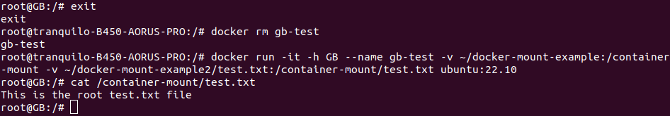