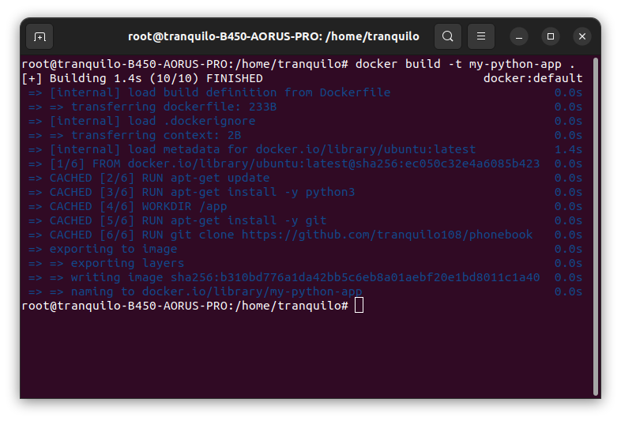

## Создаём Docker файл
```sh
nano Dockerfile
```
```Dockerfile
FROM ubuntu:latest
RUN apt-get update && \
    apt-get install -y python3 git && \
    rm -rf /var/lib/apt/lists/*
WORKDIR /app
RUN git clone https://github.com/tranquilo108/phonebook .
CMD ["python3", "main.py"]
```

## Собираем образ по нашему Dockerfile с именем my-python-app
```sh
docker build -t my-python-app .
```

## Запускаем контейнер в интерактивном режиме 
```sh
docker run -it my-python-app
```
