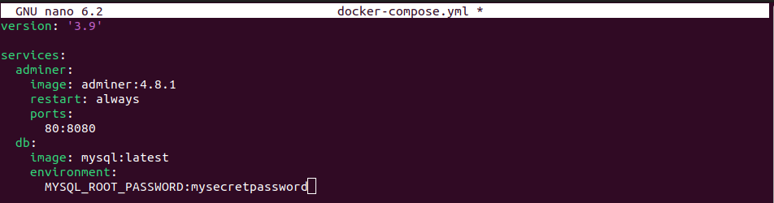

# Создание сервиса, состоящего из 2 различных контейнеров (веб и БД) с использованием Docker Compose.

### Создаём новую папку для проекта и переходим в нее. Создаём файл `docker-compose.yml` в этой папке

```sh
mkdir my_project
cd my_project
touch docker-compose.yml
nano docker-compose.yml
```

### Вносим в него следующее содержимое

```yaml
version: '3.9'

services:
  adminer:
    image: adminer:4.8.1
    restart: always
    ports:
      80:8080
  db:
    image: mysql: latest
    environment:
      MYSQL_ROOT_PASSWORD: mysecretpassword
```


В этом файле определены два сервиса: `web` и `db`. Сервис `web` использует образ `nginx:latest` и пробрасывает порт 8080 хоста на порт 80 контейнера. Сервис `db` использует образ `postgres:latest` и устанавливает пароль для PostgreSQL.

### Запускаем наши контейнеры в фоновом режиме

```sh
docker-compose up -d
```

### Для проверки работы веб-сервера, откроем веб-браузер и перейдём по адресу: http://localhost:80.


